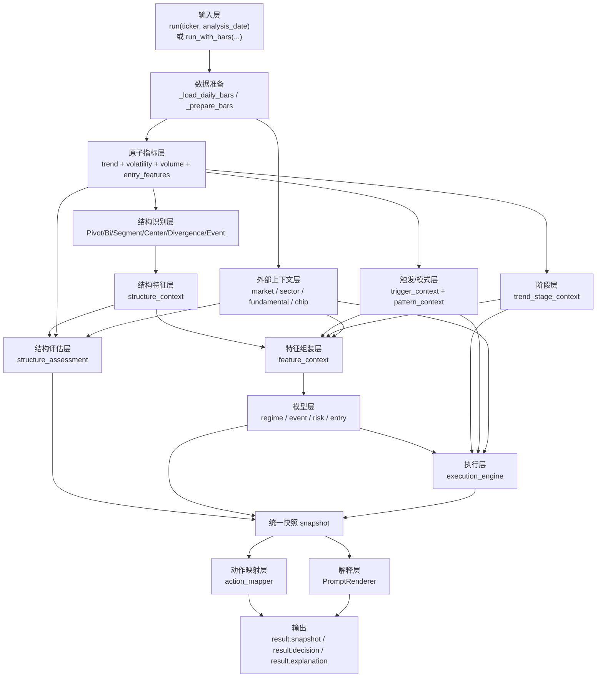
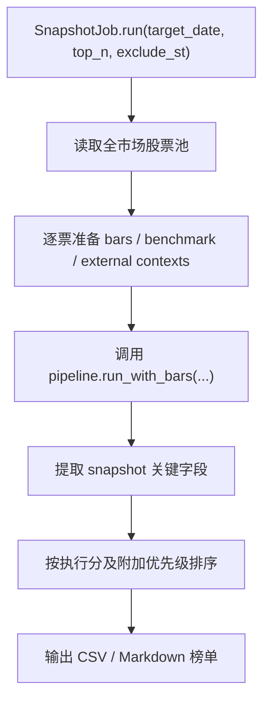

# 石论交易系统详细方案文档

本文档记录当前仓库中交易系统的实际实现口径，并作为后续系统更新的长期参照。

适用目标：

1. 供阅读，快速理解系统是如何运行、如何出结论、如何给执行建议的。
2. 作为后续修改、重构、调参、加指标时的持久化“记忆基准”。

本文档优先写“当前代码已经实现的真实行为”，而不是理想设计。若文档与代码暂时不一致，应以代码实际行为为准，并尽快回写本文档。

## 1. 阅读说明

本文档中的来源标注分三类：

- `文献`：外部经典书籍、论文、统计教材或行业标准来源。
- `知识库`：项目内部文档、需求文档、量价规范文档。
- `数据源`：字段语义主要来自外部数据接口定义。

标注规则：

- 第一次出现某类关键指标时，会在正文中给出脚注来源。
- 文末提供完整“参考文献与知识库来源索引”。

## 2. 系统定位

当前系统不是纯价格预测器，也不是全自动交易机器人。它的定位是：

- 读取日线行情与上下文数据。
- 计算趋势、波动、量能、结构、筹码、基本面等多层特征。
- 产出统一 `snapshot`。
- 基于 `snapshot` 产出结论标签、执行分、仓位建议、支撑压力位和解释文本。
- 支持单票分析、Telegram 输出、批量榜单和回测接入。

主入口在 `shilun/pipeline.py` 中的 `ShilunPipeline`。

## 3. 整体运行流程

### 3.1 单票分析主流程



### 3.2 批量快照与榜单流程



批量榜单的排序说明当前为：

```text
执行分 -> 仓位 -> Mid分 -> 温和放量/缩量回调 -> 快速失败倒序 -> 市场分 -> 板块分 -> 基本面分 -> Early分 -> 入场概率 -> 次日承接 -> 延续概率 -> Late分/分布/滞涨惩罚 -> 风险
```

## 4. 模块输入、输入内容、引用方式与输出

### 4.1 主入口输入项

系统有两个最重要的分析入口：

1. `run(ticker, analysis_date)`
2. `run_with_bars(ticker, analysis_date, bars, benchmark_bars, sector_context, fundamental_context, daily_basic_context, chip_perf_context, fina_indicator_context, metadata_context)`

二者的区别：

- `run` 由系统自行拉取行情和外部上下文。
- `run_with_bars` 允许外部直接传入已经准备好的数据，适合批量任务、回测和外部编排。

### 4.2 主模块 I/O 总表

| 模块 | 代码位置 | 输入项 | 输入内容 | 引用方式 | 输出内容 |
| --- | --- | --- | --- | --- | --- |
| 数据接入 | `ShilunPipeline.run` / `_load_daily_bars` | `ticker`, `analysis_date` | 股票代码、分析日期 | 直接函数参数；内部通过 `importer` 拉取数据 | 标准化后的日线 `bars` |
| bars 直连入口 | `ShilunPipeline.run_with_bars` | `bars`, `benchmark_bars`, 多类 context | 外部已准备的行情与上下文 | 直接函数参数透传 | 准备好的 `prepared_bars` 与上下文 |
| 趋势指标层 | `shilun/indicators/trend.py` | `bars` | `open/high/low/close/volume` 等列 | 对 `bars` 分组滚动计算 | 均线、收益率、位置、`R^2`、效率比等列 |
| 波动指标层 | `shilun/indicators/volatility.py` | 指标增强后的 `bars` | 已含价格序列 | 继续在 DataFrame 上追加列 | `ATR`、波动率、量比等列 |
| 量能指标层 | `shilun/indicators/volume.py` | 指标增强后的 `bars` | 已含价格与成交量 | 继续在 DataFrame 上追加列 | `OBV`、`VWAP`、量分位、缩量比等列 |
| 触发/模式层 | `shilun/features/entry_features.py` | 指标增强后的 `bars` | 趋势、波动、量能衍生字段 | 组合评分与状态判断 | `gentle_expand_score`、`pullback_shrink_score`、`acceptance_strength` 等 |
| 结构识别层 | `PivotDetector` 等 | 完整特征 `bars` | 价格、趋势、量价特征 | 构造结构对象 | `pivots`, `bis`, `segments`, `centers`, `events`, `divergence` |
| 结构特征层 | `StructureFeatureBuilder` | 结构对象 | `Bi/Segment/Center/Event` | 扁平化字典输出 | `structure_context` |
| 市场上下文层 | `_build_market_context` | `latest`, `benchmark_bars` | 个股收益与基准收益 | 对比 5 日/20 日收益、趋势状态 | `market_context` |
| 板块上下文层 | `_build_sector_context` | 传入或批量构造的板块信息 | 行业、板块趋势强度 | 默认补全或批量构建 | `sector_context` |
| 基本面上下文层 | `_build_fundamental_context` | `daily_basic_context`, `fina_indicator_context`, `latest` | 估值、成长、质量、负债等财务字段 | 规则打分 | `fundamental_context` |
| 筹码上下文层 | `build_chip_context` | `daily_basic`, `chip_perf`, `support_main`, `pressure_main`, `latest_close` | 筹码成本、胜率、成本峰、流通盘等 | Tushare 字段 + 结构位近似 | `chip_context` |
| 特征组装层 | `_build_feature_context` | `latest`, `structure_context`, `market_context`, `trigger_context` 等 | 前序全部关键字段 | 合并进统一字典 | `feature_context` |
| 模型层 | `TrainedModelPredictor` 或 `RuleFallbackModel` | `feature_context`, `structure_context` | 市场特征 + 结构特征 | 训练模型推理或规则回退 | `model_context` |
| 结构评估层 | `StructureAssessmentEngine.assess` | `latest`, `structure_context`, `market_context` | 趋势、结构、相对强弱 | 规则打分 | `structure_assessment` |
| 执行层 | `ExecutionEngine.evaluate` | `execution_snapshot`, `market_context`, `sector_context`, `fundamental_context`, `chip_context`, `latest_close`, `atr_abs` | 模型概率、模式分、阶段分、风险、筹码 | 组合成执行分 | `execution_score`, `entry_style`, `target_position_pct` 等 |
| 动作映射层 | `ActionMapper.map_actions` | `DecisionSnapshot` | 统一快照 | guard -> model -> rule matrix | `decision` |
| 解释层 | `PromptRenderer.render` | `LLMPayload` | 快照与动作结果 | 受约束文案拼装 | `explanation` |

### 4.3 主链路中的关键中间对象

| 对象名 | 作用 | 典型字段 |
| --- | --- | --- |
| `latest` | 当前分析日的最后一行特征 | `close`, `return_20d`, `atr_pct`, `volume_ratio` |
| `trigger_context` | 当日触发层状态 | `acceptance_strength`, `trigger_strength`, `volume_pattern` |
| `pattern_context` | 模式分与风险模式 | `gentle_expand_score`, `distribution_score`, `stall_score` |
| `trend_stage_context` | 初中末期阶段判断 | `early_stage_score`, `mid_stage_score`, `late_stage_score`, `trend_stage` |
| `structure_context` | 结构对象扁平特征 | `segment_direction`, `active_center`, `divergence_state` |
| `feature_context` | 模型层统一输入 | 市场、结构、触发、模式、筹码、基本面全部关键字段 |
| `model_context` | 模型层统一输出 | `p_continue_10d`, `entry_probability`, `risk_level` |
| `execution_snapshot` | 执行层专用输入快照 | 概率、模式分、阶段分、风险、支撑压力 |
| `snapshot` | 面向动作映射与解释的统一快照 | 结构、模型、执行层融合后的总对象 |

## 5. 数学原理与规则逻辑总览

系统的计算逻辑可以分成四层：

1. 原子指标层
   直接对时间序列做滚动统计或价格量能变换。
2. 模式与阶段层
   将多个原子指标通过加权、隶属函数和规则组合成更高层语义分数。
3. 结构与概率层
   用结构对象和模型输出回答“趋势是否成立、是否延续、风险多大”。
4. 执行与动作层
   把所有中间结果压缩成执行分、仓位、动作标签与解释文本。

其核心思想是：

- 不用单一指标直接下结论。
- 先做“位置、趋势、量能、波动、结构、筹码”的分层表达。
- 再将这些表达映射成概率、风险和执行建议。

## 6. 原子指标层

### 6.1 趋势指标[^R5][^KB1]

这些指标主要回答三个问题：

- 价格位于什么位置。
- 趋势方向是否向上。
- 趋势是否“直”和“顺”。

#### 6.1.1 均线与斜率

- `ma5 / ma10 / ma20 / ma60 / ma120`
  原理：不同周期均线，代表不同成本线与趋势观察窗口。均线分析、趋势跟随和支撑阻力语义主要参考 Murphy 的技术分析框架。[^R5]
- `ma_slope`
  当前实现为 20 日均线一阶差分，用于兼容旧逻辑。
- `ma5_slope / ma10_slope / ma20_slope / ma60_slope / ma120_slope`
  原理：均线是否在抬升，体现趋势惯性。

#### 6.1.2 收益率与区间位置

- `return_1d / return_5d / return_10d / return_20d`
  公式：`close_t / close_t-n - 1`
  原理：多周期收益率是趋势与动量的最基础表达。
- `recent_high_5 / 20 / 60`，`recent_low_5 / 20 / 60`
  原理：窗口内阶段高低点，用于衡量是否接近突破或支撑区。
- `close_to_recent_high_5 / 20 / 60`
  公式：`close / recent_high - 1`
- `close_to_recent_low_5 / 20 / 60`
  公式：`close / recent_low - 1`
- `close_to_ma20 / close_to_ma60`
  公式：`close / ma - 1`

#### 6.1.3 标准化与趋势拟合

- `price_vs_ma20_z / price_vs_ma60_z`
  公式：`(close - ma) / rolling_std(close, n)`
  原理：标准化位置，属于典型 z-score 标准化思想。[^R6]
- `trend_r2_20 / trend_r2_60`
  原理：对滚动窗口内价格做线性拟合，取决定系数 `R^2`，用来衡量趋势是否接近线性上升或下降。决定系数定义参考统计回归教材。[^R7]
- `efficiency_ratio_10 / 20 / 60`
  公式：`abs(close_t - close_t-n) / rolling_sum(abs(diff(close)), n)`
  原理：Kaufman Efficiency Ratio，衡量净位移相对路径长度的效率，越高说明价格推进越顺。[^R3]

### 6.2 波动指标[^R1][^R5]

这些指标主要回答“波动有多大、风险有多高、支撑/止损需要留多大缓冲”。

- `tr`
  公式：`max(high-low, abs(high-prev_close), abs(low-prev_close))`
- `atr14 / atr_14`
  原理：Wilder 提出的 Average True Range，用于衡量真实波动幅度。[^R1]
- `atr_pct`
  公式：`atr14 / close`
- `volatility_10d`
  原理：10 日收益率标准差。
- `realized_vol_20`
  原理：20 日收益率标准差。
- `range_ratio_10 / range_ratio_20`
  原理：窗口振幅相对均价的比例。
- `vol_compression_ratio`
  公式：`volatility_10d / realized_vol_20`
  原理：短期是否进入波动压缩或扩张。

### 6.3 量能指标[^R2][^R4][^R5]

这些指标主要回答“量是否支持趋势、是否放量突破、是否缩量回踩”。

- `obv`
  原理：Granville 的 On-Balance Volume，按涨跌方向对成交量做符号累积。[^R2]
- `obv_slope_10`
  原理：OBV 10 日斜率，观察量能趋势。
- `vwap_20`
  原理：成交量加权平均价思想，行业中常用作执行与成本基准。[^R4]
- `vwap_distance`
  公式：`close / vwap_20 - 1`
- `volume_ratio_5`
  原理：当日量相对 5 日均量的放缩程度。
- `vol_pct_60`
  原理：当前量在近 60 日中的分位数。
- `breakout_volume_percentile`
  当前实现与 `vol_pct_60` 同口径，用作突破量确认参考。
- `pullback_volume_shrink_ratio`
  公式：`MA(volume, 5) / MA(volume, 20)`
  原理：回踩是否健康缩量。

### 6.4 K 线质量指标[^R5][^KB1]

- `close_near_high_pct`
  公式：`(high - close) / intraday_range`
  原理：收盘离最高点越近，当日收盘越强。
- `close_near_high_inv`
  原理：`close_near_high_pct` 的正向量。
- `upper_shadow_ratio`
  原理：上影线占比，常用于识别冲高受阻或分歧。
- `lower_shadow_ratio`
  原理：下影线占比，常用于识别下探承接。
- `body_ratio`
  原理：实体占比，观察实体推进是否扎实。
- `body_ratio_inv`
  原理：实体弱的惩罚量。
- `gap_pct`
  原理：跳空幅度。

## 7. 模式分、触发分与阶段分

这层定义了“更接近交易语言”的中间指标，它们不是文献中的固定标准指标，而是项目对经典量价与趋势思想的工程化组合，主要来源于内部量价规范和代码实现。[^KB1][^KB2]

### 7.1 梯形隶属函数

系统广泛使用 `trap(a, b, c, d)`，其思想来自模糊隶属与工程化评分：

```text
trap(x; a,b,c,d)
= 0                       , x <= a or x >= d
= (x-a)/(b-a)            , a < x < b
= 1                       , b <= x <= c
= (d-x)/(d-c)            , c < x < d
```

作用：

- 避免把市场状态硬切成“满足 / 不满足”。
- 用“舒适区间”表达较符合交易直觉。

### 7.2 量价模式分

#### `gentle_expand_score`[^KB1]

目标：

- 识别适合趋势初期和中期的健康放量。
- 排除极端爆量、长上影、高位分歧。

主要输入：

- `volume_spike_ratio`
- `vol_pct_60`
- `close_near_high_inv`
- `body_ratio`
- `efficiency_ratio_20`
- 惩罚：`upper_shadow_ratio`
- 惩罚：`high_zone_flag`

原理：

- 适度放量、收盘强、实体足、效率高，说明趋势推进更健康。

#### `pullback_shrink_score`[^KB1]

目标：

- 识别健康回踩而非放量回落。

主要输入：

- `pullback_volume_shrink_ratio`
- `close_to_ma20`
- `efficiency_ratio_20`
- `lower_shadow_ratio`
- `close_near_high_inv`
- 修正：`trend_alignment_flag`
- 惩罚：`high_zone_flag`

原理：

- 缩量回踩、价格仍守住趋势成本线，说明承接质量较好。

#### `impulsive_spike_score`[^KB1]

主要输入：

- 极端 `volume_spike_ratio`
- `vol_pct_60`
- 单日绝对涨跌幅
- `upper_shadow_ratio`

原理：

- 更像脉冲和情绪冲击，不一定适合追。

#### `distribution_score`[^KB1]

主要输入：

- `high_zone_flag`
- `volume_spike_ratio`
- `upper_shadow_ratio`
- `body_ratio_inv`
- `efficiency_ratio_20_inv`

原理：

- 高位放量但收盘质量和推进效率差，倾向于高位分歧或派发。

#### `stall_score`[^KB1]

主要输入：

- `high_zone_flag`
- `volume_spike_ratio`
- `return_5d`
- `price_center_shift_5`
- `efficiency_ratio_20_inv`

原理：

- 高位滞涨，重心不再抬升，趋势质量下降。

### 7.3 触发与准备度指标

#### `acceptance_strength`[^KB1]

主要输入：

- `body_ratio`
- `close_near_high_inv`
- `lower_shadow_ratio`
- `volume_spike_ratio`
- `efficiency_ratio_20`
- `gentle_expand_score`
- `pullback_shrink_score`

原理：

- 当天收盘是否稳、是否有承接。

#### `trigger_strength`[^KB1]

主要输入：

- `breakout_confirm_flag`
- `acceptance_strength`
- `gentle_expand_score`
- `pullback_shrink_score`
- `false_breakout_risk_flag`
- `distribution_score`
- `stall_score`
- `acceleration_score`

原理：

- 不是只看突破，而是看“今天这一根 K 线与量能是否足够构成触发”。

#### `trend_truth_score`[^KB1]

主要输入：

- `efficiency_ratio_20`
- `trend_r2_20`
- `gentle_expand_score`
- `pullback_shrink_score`
- `trend_alignment_flag`
- 惩罚：`false_breakout_risk_flag / distribution_score / stall_score / impulsive_spike_score`

原理：

- 区分“真实趋势推进”和“短促噪音上涨”。

#### `buy_readiness_score`[^KB1]

主要输入：

- `trend_truth_score`
- `trigger_strength`
- `acceptance_strength`
- `gentle_expand_score`
- `pullback_shrink_score`
- 惩罚：`distribution_score / stall_score`

原理：

- 综合衡量“现在是否接近可买状态”。

### 7.4 阶段分 `early / mid / late`

#### `early_stage_score_base`[^KB1]

主要输入：

- `low_base_flag`
- `breakout_recently_flag`
- `gentle_expand_score`
- `ma20_slope_5`
- `return_20d`
- `high_zone_flag` 反向
- `peak_shift_up_flag`

原理：

- 低位、刚启动、成本重心开始抬升。

#### `mid_stage_score_base`[^KB1]

主要输入：

- `trend_alignment_flag`
- `pullback_shrink_score`
- `gentle_expand_score`
- `efficiency_ratio_20`
- `trend_r2_20`
- `close_to_ma20`
- `distribution_score` 反向

原理：

- 趋势已成形，推进与回踩节奏都更健康。

#### `late_stage_score_base`[^KB1]

主要输入：

- `high_zone_flag`
- `distribution_score`
- `stall_score`
- `impulsive_spike_score`
- `return_20d`
- `upper_shadow_ratio`
- `efficiency_ratio_20_inv`

原理：

- 高位、分歧、效率下降、情绪化脉冲增加。

### 7.5 筹码与环境修正后的 `trend_stage`

最终 `early / mid / late` 还会叠加：

- `winner_ratio`
- `overhang_ratio`
- `support_density`
- `pressure_density`
- `vacuum_up_ratio`
- `chip_concentration`
- `peak_shift_5d`
- `market_trend_score`
- `sector_trend_score`
- `sector_stage`

判定逻辑：

1. 先算 `early / mid / late` 三个分值。
2. 取最高分作为候选阶段。
3. 若 `return_20d <= 0` 或最高分 `< 55`，统一降级为 `transition`。

原理：

- 阶段不只看涨幅，还看筹码拥挤度与环境是否匹配。

## 8. 结构识别与结构特征

结构对象由以下模块生成：

- `PivotDetector`
- `BiBuilder`
- `SegmentBuilder`
- `CenterDetector`
- `DivergenceDetector`
- `EventEngine`

随后由 `StructureFeatureBuilder` 扁平化为模型和规则可用字典。

### 8.1 关键结构特征[^KB2][^KB3]

- `bi_count / segment_count / center_count`
- `last_bi_direction / last_bi_amplitude_pct / last_bi_bars / last_bi_impulse_score`
- `last_3_bi_up_ratio`
- `segment_direction / segment_amplitude_pct / segment_bi_count / segment_impulse_score`
- `active_center_flag`
- `center_width_pct / center_touch_count / center_shift_direction / center_shift_pct`
- `distance_to_center_upper / distance_to_center_lower`
- `leave_center_strength`
- `return_test_depth`
- `latest_event_type`
- `divergence_score / divergence_state`

### 8.2 结构特征的数学含义

- `leave_center_strength`
  原理：线段离开中枢的程度，越强说明脱离中枢越有力。
- `return_test_depth`
  原理：离开中枢后回试的深浅，越深说明结构延续质量越差。
- `divergence_score / divergence_state`
  原理：结构背驰风险。

## 9. 上下文层：市场、板块、基本面、筹码

### 9.1 市场上下文 `market_context`[^R5]

关键字段：

- `benchmark_weekly_trend`
- `benchmark_daily_state`
- `benchmark_return_5d / benchmark_return_20d`
- `excess_return_5d / excess_return_20d`
- `relative_strength_label`
- `market_trend_score`
- `market_stage`

`market_trend_score` 逻辑：

- 基础值 50
- 周线向上加分，向下减分
- 日线推进加分，衰竭减分
- 基准 5 日和 20 日收益率分别做裁剪后映射

原理：

- 衡量当前市场是不是“顺风”。

### 9.2 板块上下文 `sector_context`[^KB2]

关键字段：

- `sector_trend_score`
- `sector_strength_score`
- `sector_stage`

原理：

- 行业均值收益可以近似板块共振强度。

### 9.3 基本面上下文 `fundamental_context`[^R5][^KB2]

关键中间分：

- `valuation_score`
  参考：`pe / pb / ps_ttm`
- `quality_score`
  参考：`turnover_rate / roe_dt / grossprofit_margin / ocf_to_or / 流通市值占比 / 近期表现`
- `growth_score`
  参考：`or_yoy / op_yoy / q_sales_yoy / q_dtprofit_yoy`
- `balance_sheet_score`
  参考：`debt_to_assets / current_ratio / quick_ratio`

最终：

```text
fundamental_score
= 0.20 * valuation_score
+ 0.35 * quality_score
+ 0.25 * growth_score
+ 0.20 * balance_sheet_score
```

原理：

- 用弱规则方式表达“财务顺风 / 逆风”，而不是完整估值模型。

### 9.4 筹码上下文 `chip_context`[^KB1][^KB4][^KB5]

字段语义主要参考 Tushare `cyq_perf / cyq_chips` 的筹码分布字段，再结合项目内部近似规则。[^KB4][^KB5]

关键字段：

- `avg_cost / cost_15 / cost_50 / cost_85 / cost_95`
- `winner_ratio`
- `overhang_ratio`
- `support_density`
- `pressure_density`
- `cost_band_width`
- `vacuum_up_ratio`
- `chip_concentration`
- `peak_shift_5d`

数学含义：

- `winner_ratio`
  当前价以下筹码占比，过高时既可能说明强势，也可能说明后段拥挤。
- `overhang_ratio`
  上方成本或压力区相对当前价的压制强度。
- `support_density`
  下方近邻成本峰与当前价的贴近程度。
- `pressure_density`
  上方近邻成本峰与当前价的贴近程度。
- `vacuum_up_ratio`
  上方阻力稀薄程度，越高越利于空间打开。
- `chip_concentration`
  成本带越窄、集中度越高。
- `peak_shift_5d`
  主成本峰最近 5 日是否上移。

## 10. 结构评估层 `structure_assessment`

这一层由 `StructureAssessmentEngine.assess` 实现，输出：

- `trend_bias`
- `structure_stage`
- `confirmation_state`
- `strength_score`
- `confirmation_score`
- `risk_score`
- `confidence`
- `support_level / resistance_level / invalidation_level`

### 10.1 `strength_score`

主要输入：

- `close_to_ma20`
- `close_to_ma60`
- `return_20d`
- `return_5d`
- `excess_return_20d`
- `excess_return_5d`
- `leave_center_strength`
- `ma20_slope`
- `segment_direction`
- `center_shift_direction`
- `latest_event_type`
- `divergence_state`
- `benchmark_weekly_trend`

原理：

- 结构强度不仅看趋势位置，也看相对强弱和结构延伸质量。

### 10.2 `confirmation_score`

主要输入：

- `close_to_recent_high`
- `latest_event_type == breakout_up`
- `breakout_volume_percentile`
- `volume_ratio`
- `pullback_volume_shrink_ratio`
- `segment_direction`
- `excess_return_5d`
- `divergence_state`
- `return_test_depth`

原理：

- 不是只看“是否突破”，而是看位置、量能与结构确认是否匹配。

### 10.3 `risk_score`

主要输入：

- `volatility_10d`
- `close_to_ma20 < 0`
- `return_test_depth`
- `latest_event_type == breakout_down`
- `divergence_state`
- `benchmark_weekly_trend == down`
- `excess_return_20d < -0.04`

原理：

- 风险同时包含波动风险、结构失效风险与市场逆风风险。

### 10.4 结构阶段 `structure_stage`

输出语义：

- `breakout_confirmed`
- `breakout_attempt`
- `trend_pressing_high`
- `trend_pullback`
- `trend_advancing`
- `breakdown`
- `distribution`
- `range_rotation`
- `rebound_repair`
- `transition`

它是“结构语言层”，用于承接后面的机会类型和动作逻辑。

## 11. 模型层

### 11.1 模型层输出对象

模型层统一输出：

- `RegimePrediction`
- `EventPrediction`
- `RiskPrediction`
- `EntryCurvePrediction`

合并后得到：

- `regime_label / regime_score / regime_confidence`
- `p_continue_10d`
- `p_breakout_success`
- `p_fail_5d`
- `p_acceptance_1d`
- `p_fail_fast_3d`
- `expected_return_10d`
- `expected_drawdown_10d`
- `risk_level`
- `entry_probability / entry_zone`

### 11.2 训练模型与回退模型

系统优先尝试加载训练模型：

- `regime_model.joblib`
- `event_model.joblib`
- `risk_model.joblib`
- 可选 `entry_model.joblib`

如果未配置或加载失败，则回退到 `RuleFallbackModel`。

### 11.3 回退模型的数学逻辑

回退模型不是简单硬编码标签，而是“可解释概率映射层”。

#### `regime`

主要输入：

- `price_vs_ma20_z`
- `trend_r2_20`
- `efficiency_ratio_20`
- `excess_return_20d`
- `excess_return_5d`
- `leave_center_strength`
- `segment_direction`
- `benchmark_weekly_trend`
- `divergence_state`

输出：

- `strong_up / weak_up / range / weak_down / risk_reversal`

#### `event`

输出：

- `p_continue_10d`
- `p_breakout_success`
- `p_fail_5d`
- `p_acceptance_1d`
- `p_fail_fast_3d`

关键逻辑：

- 延续概率更多看趋势效率、超额收益、结构离中枢强度。
- 突破成功率更多看突破量、结构出中枢强度、回试深度。
- 失败概率更多看 ATR、背驰、结构回试深度和市场环境。
- 快败概率更多看假突破、上影、ATR、承接弱化。

#### `risk`

输出：

- `expected_return_10d`
- `expected_drawdown_10d`
- `risk_level`

原理：

- 用延续/失败/快败概率与波动率映射预期收益与回撤。

#### `entry`

输出：

- `entry_probability`
- `entry_zone`

关键逻辑：

- regime 向上、承接强、突破有效、量价模式健康、位置不差，则入场概率上升。
- 假突破、快败风险、分布、滞涨、高位与下跌位置会降低入场概率。

## 12. 执行层：执行分、风险分、仓位与价格带

执行层由 `ExecutionEngine` 完成，是当前系统中最接近“交易执行建议”的模块。

### 12.1 七个中间指标

执行层先计算以下 7 个 0~100 分数：

- `continuation_edge`
- `execution_quality`
- `regime_tailwind`
- `support_quality`
- `fast_fail_penalty`
- `overhang_pressure`
- `risk_penalty`

### 12.2 七个中间指标的结论依据

| 中间指标 | 结论依据的核心指标 | 映射原理 |
| --- | --- | --- |
| `continuation_edge` | `p_continue_10d`, `p_acceptance_1d`, `entry_probability`, `gentle_expand_score`, `pullback_shrink_score`, `mid/early/late_stage_score`, `market_trend_score`, `sector_strength_score`, `fundamental_score` | 衡量继续上涨的赔率、顺风和阶段位置 |
| `execution_quality` | `p_acceptance_1d`, `entry_probability`, `trigger_state`, `breakout_quality`, `pullback_quality`, `opportunity_type`, `gentle_expand_score`, `pullback_shrink_score`, `distribution_score`, `stall_score`, `impulsive_spike_score` | 衡量“现在适不适合执行” |
| `regime_tailwind` | `market_trend_score`, `sector_trend_score`, `sector_strength_score` | 衡量大盘与板块顺风程度 |
| `support_quality` | `support_main`, `support_basis`, `support_density`, `pullback_quality`, `pullback_shrink_score`, `mid_stage_score` | 衡量下方支撑是否可靠 |
| `fast_fail_penalty` | `p_fail_fast_3d` | 衡量短期很快做错的风险 |
| `overhang_pressure` | `chip_pressure`, `overhang_ratio`, `pressure_density`, `vacuum_up_ratio`, `winner_ratio` | 衡量上方压力是否过重 |
| `risk_penalty` | `risk_score`, `risk_level`, `late_stage_score`, `distribution_score`, `stall_score`, `early_stage_score` | 衡量综合风险与趋势末期风险 |

### 12.3 执行分公式

```text
execution_score
= continuation_edge   * w1
+ execution_quality   * w2
+ regime_tailwind     * w3
+ support_quality     * w4
- fast_fail_penalty   * w5
- overhang_pressure   * w6
- risk_penalty        * w7
```

专家先验权重：

- `continuation_edge`: `0.30`
- `execution_quality`: `0.20`
- `regime_tailwind`: `0.15`
- `support_quality`: `0.15`
- `fast_fail_penalty`: `0.25`
- `overhang_pressure`: `0.15`
- `risk_penalty`: `0.10`

最终权重不是固定死值，而是：

```text
final_weight = 0.65 * entropy_weight + 0.35 * expert_weight
```

原理：

- `entropy_weight` 反映当日各项指标的信息分化。
- `expert_weight` 反映业务偏置。
- 组合后既保留动态性，也保留人为控制。

### 12.4 执行风险分

```text
execution_risk_score = 0.55 * risk_penalty + 0.45 * fast_fail_penalty
```

### 12.5 执行硬门槛

以下情况任一满足都会直接禁止执行：

- `p_fail_fast_3d >= 0.45`
- `risk_score >= 70` 且 `late_stage_score >= 60`
- `overhang_ratio >= 0.12`
- `distribution_score >= 65`
- `entry_probability < 0.45`
- `trigger_state == exhausted`
- 当前价距失效位过近

### 12.6 执行动作与仓位映射

| 条件 | 输出动作 | 目标仓位 |
| --- | --- | --- |
| `execution_score >= 42` 且 `execution_risk_score <= 28` | `build` | `50%`，若 `entry_style == no_chase` 则 `35%` |
| `execution_score >= 30` 且 `execution_risk_score <= 40` | `probe` | `20%` |
| `execution_score >= 22` 且 `execution_risk_score <= 55` | `watch` | `10%` |
| 其他情况或触发硬门槛 | `stand_aside` | `0%` |

### 12.7 支撑带、压力带、入场带、失效位

- `support_band`
  来源：`support_main` 优先，否则 `cost_50 / cost_15 / avg_cost`
- `pressure_band`
  来源：`pressure_main` 优先，否则 `cost_85 / cost_95`
- `entry_band`
  来源：
  - `late_stage_score >= 60` 时追涨禁入，`no_chase`
  - `first_buy` 或 `pullback_shrink_score >= 60` 时优先回踩带
  - `trigger_state == confirmed` 且 `gentle_expand_score >= 55` 时允许突破带
- `invalidation_price`
  来源：`invalidation_level` 优先，否则 `support_band_low` 再减去 ATR 缓冲

## 13. 从指标到结论：结论依据如何映射

这一节专门回答“结论依据的指标是什么，如何映射指标与结论”。

### 13.1 触发状态 `trigger_state`

| 结论 | 核心依据 | 解释 |
| --- | --- | --- |
| `confirmed` | `breakout_quality == valid`、`breakout_confirm_flag == 1`、结构确认、`acceptance_strength >= 0.5`、`trigger_strength >= 56`、量价模式非 `impulsive_spike/high_level_stall`、位置非 `high_zone` | 今日更像一个可执行的确认日 |
| `watch` | 未满足 `confirmed`，但也未明显衰竭 | 仍需观察 |
| `exhausted` | `false_breakout_risk_flag == 1` 或 `distribution_risk_flag == 1` 或 `volume_pattern == distribution` | 今日更像衰竭或假突破 |

### 13.2 机会类型 `opportunity_type`

| 结论 | 核心依据 | 解释 |
| --- | --- | --- |
| `first_buy` | `structure_stage` 属于回踩修复类、`pullback_quality` 健康、位置在 `low_base/rising`、`volume_pattern` 不差、承接不弱、无假突破风险 | 更像第一次可参与回踩 |
| `trend_follow` | `breakout_quality == valid`、`trigger_state == confirmed`、量价模式健康、位置不差、触发强度高 | 更像趋势跟随买点 |
| `observe` | 突破并非完全无效，但证据还不够强 | 继续观察 |
| `reject` | 衰竭、分布、条件明显不足 | 不应继续进攻 |

### 13.3 动作结论 `conclusion_label`

动作结论由三层规则叠加：

1. `guard_conclusion`
2. `model_conclusion`
3. `conclusion_matrix`

#### `guard_conclusion`

先处理明显风险：

- `opportunity_type == reject` 或 `trigger_state == exhausted`
  -> `defense_first`
- `observe + suspicious breakout + entry_probability < 0.5`
  -> `confirmation_needed`

#### `model_conclusion`

| 结论 | 核心依据 | 解释 |
| --- | --- | --- |
| `defense_first` | 结构确认失败且置信度高，或 `p_fail_5d >= 0.58`，或 `p_fail_fast_3d >= 0.48`，或 `regime_label == risk_reversal` | 先防守 |
| `high_quality_continuation` | `regime_label` 向上、`p_continue_10d >= 0.62`、`p_breakout_success >= 0.55`、`p_fail_5d <= 0.35`、`entry_probability >= 0.58`、突破有效、触发确认、机会类型优质、分区 `ready/candidate` | 高质量延续 |
| `confirmation_needed` | `regime_label` 向上、`p_continue_10d >= 0.52`、`entry_probability >= 0.42`、结构确认未坏、机会未被拒绝 | 方向偏对，但确认不足 |
| `momentum_but_heavy_overhead` | `regime_label == range` 且 `p_fail_5d <= 0.45` | 有动量，但上方压力重 |

#### `conclusion_matrix`

配置文件仍保留规则矩阵，用于兜底匹配：

- `high_quality_continuation`
  参考：`structure_score >= 70`、`breakout_quality == valid`、`price_action_quality == healthy`、`chip_vacuum == open`、`risk_score <= 45`
- `confirmation_needed`
  参考：`structure_score >= 55`、`breakout_quality in suspicious/unknown`、`risk_score <= 65`
- `momentum_but_heavy_overhead`
  参考：`volume_score >= 60`、`chip_pressure == high`、`risk_score <= 70`

### 13.4 总结：指标如何映射到最终结论

可以把整套系统简化成下面这个映射：

```text
原子指标
-> 模式分 / 阶段分 / 结构特征 / 筹码上下文
-> 结构评估 + 模型概率
-> trigger_state / opportunity_type / execution_score
-> conclusion_label / watching_action / holding_action
```

所以最终结论不是“某个指标大于阈值”的单点判断，而是多层映射结果。

## 14. 排序层与批量榜单

榜单显示的主要字段包括：

- `执行分`
- `仓位`
- `入场概率`
- `次日承接`
- `快速失败`
- `Early分 / Mid分 / Late分`
- `市场分 / 板块分 / 基本面分`
- `结构分`
- `风险分 / 模型风险`

其排序目标不是“纯上涨潜力最大”，而是“当前最值得执行且性价比最高”。

## 15. 当前实现中的一个注意点

当前 `ExecutionEngine._overhang_pressure()` 会读取 `snapshot["chip_pressure"]`，但执行层输入快照构建时并没有显式把 `chip_pressure` 放进 `execution_snapshot`。

这意味着当前 `overhang_pressure` 主要依赖：

- `overhang_ratio`
- `pressure_density`
- `vacuum_up_ratio`
- `winner_ratio`

而 `chip_pressure` 的档位基数没有完全按设计传入。这个点建议后续单独修正。

## 16. 后续更新时的建议工作流

如果以后要继续迭代，建议按下面的方式维护“记忆持久”：

1. 先确定改动属于哪一层：
   - 原子指标
   - 模式分 / 阶段分
   - 结构识别 / 结构评估
   - 模型层
   - 执行层
   - 动作映射层
   - 排序层
2. 先更新本文件相应章节，再动代码或同步动代码。
3. 任何涉及字段名、权重、阈值、输出语义的改动，都必须回写本文档。
4. 任何会影响 `snapshot / decision / explanation` 的改动，都建议补测试。

## 17. 参考文献与知识库来源索引

### 17.1 外部文献

[^R1]: J. Welles Wilder Jr., *New Concepts in Technical Trading Systems* (1978). ATR 与 True Range 的经典来源。Google Books: https://books.google.com/books/about/New_Concepts_in_Technical_Trading_Syst.html?id=WesJAQAAMAAJ

[^R2]: Joseph E. Granville, *Granville's New Key to Stock Market Profits* (1963). OBV 的经典来源。Google Books: https://books.google.com/books/about/Granville_s_New_Key_to_Stock_Market_Pro.html?id=0XVOAQAAMAAJ

[^R3]: Perry J. Kaufman, *Trading Systems and Methods* (5th ed.). Efficiency Ratio 的经典来源之一。Google Books: https://books.google.com/books/about/Trading_Systems_and_Methods.html?id=2v6U7QW8eGIC

[^R4]: Bruce Berkowitz, Dennis Logue, Eugene Noser Jr., “The Total Cost of Transactions on the NYSE” (1988). VWAP 作为执行与成本基准的经典文献来源之一。摘要页：https://ideas.repec.org/a/cup/jfinqa/v23y1988i01p97-112_01.html

[^R5]: John J. Murphy, *Technical Analysis of the Financial Markets* (1999). 均线、趋势、支撑阻力、量价关系等技术分析框架的经典来源。Google Books: https://books.google.com/books/about/Technical_Analysis_of_the_Financial_Mark.html?id=5zhFAAAAYAAJ

[^R6]: OpenStax, *Introductory Statistics 2e*. z-score 与标准化的统计学基础教材来源。https://openstax.org/details/books/introductory-statistics-2e

[^R7]: Penn State STAT 501 / 500 在线课程中关于决定系数 `R^2` 与线性回归的说明，可作为 `trend_r2` 的统计学背景来源。https://online.stat.psu.edu/stat501/lesson/1/1.5

### 17.2 项目知识库与数据源

[^KB1]: `docs/volume_stage_quant_spec.md`。量价模式、趋势阶段、筹码地形的内部工程规范。

[^KB2]: `01_一期技术PRD.md`。系统定位、模块分层和一期目标。

[^KB3]: `开发任务清单.md`。特征工程、模型层与 pipeline 分层的任务定义。

[^KB4]: Tushare Pro `cyq_perf` 文档，平均成本、分位成本、胜率等字段的语义来源。https://tushare.pro/document/2?doc_id=293

[^KB5]: Tushare Pro `cyq_chips` 文档，逐价格筹码分布明细字段的语义来源。https://tushare.pro/document/2?doc_id=294
